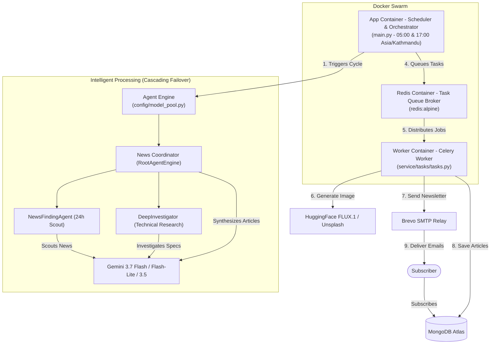
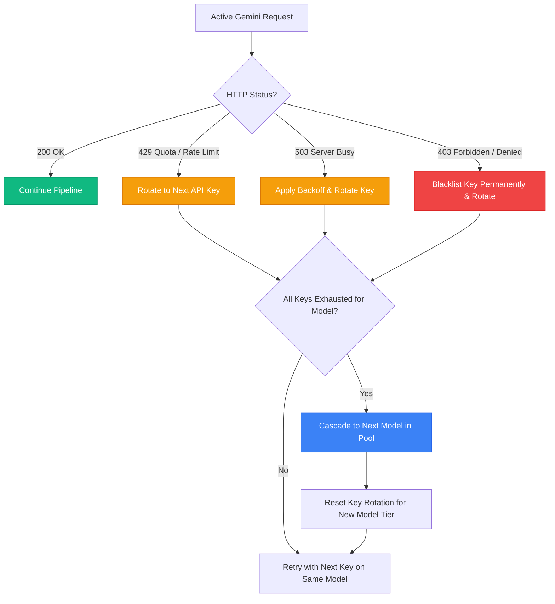

# ⚡ LucidTrend — Autonomous Multi-Agent Tech Journalism & Newsletter Engine

[](https://www.python.org/)
[](https://www.docker.com/)
[](https://docs.celeryq.dev/)
[](https://redis.io/)
[](https://www.mongodb.com/)
[](https://deepmind.google/technologies/gemini/)
[](https://huggingface.co/black-forest-labs/FLUX.1-schnell)
[](https://ai.google.dev/)

**LucidTrend** is a production-grade, zero-touch autonomous AI newsroom and digital publishing engine. Operating **100% perpetually free ($0 cost)** with zero human intervention, it functions as an automated digital editorial team: discovering breaking 24-hour technology news, conducting deep architectural research, writing comprehensive articles, generating custom AI visuals, detecting duplicates with zero token overhead, persisting content to MongoDB, and delivering modern responsive HTML email briefings to verified subscribers.

---

## 📑 Table of Contents

1. [Core Philosophy: Zero-Touch Automation](#-core-philosophy-zero-touch-automation)
2. [System Architecture](#-system-architecture)
3. [How LucidTrend Works (Daily Cycle)](#-how-lucidtrend-works-daily-cycle)
   * [Phase 1: Scheduler Boot & Environment Validation](#phase-1-scheduler-boot--environment-validation)
   * [Phase 2: Cascading Multi-Agent Research Swarm](#phase-2-cascading-multi-agent-research-swarm)
   * [Phase 3: Zero-Token Local Sanitization & Parsing](#phase-3-zero-token-local-sanitization--parsing)
   * [Phase 4: Parallel Imagery & Database Persistence (Celery)](#phase-4-parallel-imagery--database-persistence-celery)
   * [Phase 5: Zero-Token Semantic Deduplication](#phase-5-zero-token-semantic-deduplication)
   * [Phase 6: Automated Newsletter Broadcast](#phase-6-automated-newsletter-broadcast)
4. [Multi-Key & Multi-Model Cascading Resilience](#-multi-key--multi-model-cascading-resilience)
5. [Directory Overview](#-directory-overview)
6. [Environment Variables](#-environment-variables)
7. [Commands & Execution](#-commands--execution)
8. [Why This Stack?](#-why-this-stack)
9. [Author & Credits](#-author--credits)

---

## 🌐 Core Philosophy: Zero-Touch Automation

LucidTrend is built on the foundation of **autonomous recurrence and complete self-healing**.
Once deployed, it acts as a self-sustaining system that:

* ⏰ **Triggers autonomously** on a dual schedule (05:00 and 17:00 Asia/Kathmandu) or instantly on-demand via `--now`.
* 🛡️ **Handles API limits and downtime** via multi-key rotation and multi-model waterfalls with zero crashes.
* ⚡ **Eliminates token waste** using single-pass prompt synthesis and fast zero-token local post-processing.
* 🧹 **Runs clean in-memory** with zero temporary disk files and automatic fuzzy deduplication.
* 📰 **Produces polished, publication-ready journalism** equipped with deep architectural insights, custom visuals, and subscriber newsletters.

It turns raw internet signals into structured, distributed technology news without any human oversight.

---

## 🏗️ System Architecture

The system is containerized via **Docker Compose**, dividing responsibilities across three core services:



---

## 🔄 How LucidTrend Works (Daily Cycle)

LucidTrend operates twice every day at **05:00 AM** and **05:00 PM (17:00)** Asia/Kathmandu time, triggered automatically by the scheduler inside `main.py` (or instantly triggered via the `--now` CLI flag).

---

### **Phase 1: Scheduler Boot & Environment Validation**

When the clock hits the scheduled time or an immediate run is triggered:

1. **Environment Validation:**
   Verifies required credentials (`MONGO_URI`, `GOOGLE_API_KEY`, `SMTP_SERVER`, `SMTP_USER`, `SMTP_PASSWORD`).
2. **Timezone Calibration:**
   Configures execution strictly to `Asia/Kathmandu`.
3. **Pipeline Launch:**
   Initiates the asynchronous `run_daily_cycle()` workflow with isolated error boundaries.

---

### **Phase 2: Cascading Multi-Agent Research Swarm**

The `AgentEngine` activates a trio of specialized AI personas powered by **Gemini 3.7 Flash** (with automatic fallback to `gemini-flash-latest`, `gemini-flash-lite-latest`, and `gemini-3.5-flash-lite`):

#### **1. The Scout — `NewsFindingAgent` (`engine/news_engine.py`)**
* Scans real-time technological events published strictly within the past 24 hours using real-time Google Search grounding.
* Filters out low-impact rumors, targeting major runtime releases, cloud infrastructure shifts, AI models, and developer tooling.
* Outputs a clean, verified list of breakthrough candidate headlines.

#### **2. The Investigator — `DeepInvestigator` (`engine/dsearch_engine.py`)**
* Performs deeper investigative research on each candidate headline.
* Cross-references claims across primary documentation, official engineering blogs, GitHub release diffs, and benchmark reports.
* Discards unverified topics and synthesizes 3–5 concrete technical facts per topic.

#### **3. The Editor-in-Chief — `RootAgentEngine` (`engine/root_agent.py`)**
* Supervises subagents as callable tools (`AgentTool`) and executes a **single-pass synthesis**.
* In one single prompt, produces:
  * An authoritative 400+ word Markdown blog post with structured headings (`## What Changed & Technical Architecture`, `## Performance & Benchmarks`, `## Developer Impact`).
  * SEO kebab-case slug and curated category tags.
  * An exact 2-word photo search keyword.
  * A cinematic 16:9 prompt for AI image generation.

---

### **Phase 3: Zero-Token Local Sanitization & Parsing**

All agent responses pass through an ultra-fast local sanitization layer:

* **Zero-Token JSON Extraction (`service/data_cleaning/gemini.py`):**
  Parses structured article objects directly using fast local regex and bracket matching. Eliminates unnecessary secondary LLM calls, keeping 100% of your Gemini token quota dedicated to news research.
* **In-Memory Transport:**
  Article data transitions directly in memory to the database and task layers without saving or deleting temporary files on disk.

---

### **Phase 4: Parallel Imagery & Database Persistence (Celery)**

The scheduler hands off resource-intensive generation tasks to Celery background workers:

#### **1. High-Speed Image Generation Ladder (`service/image_helper/get_image.py`)**
* **Primary (FLUX.1-schnell):** Generates high-resolution visuals using Hugging Face's 4-step fast inference model.
* **Fallback Level 1 (Unsplash):** If Hugging Face is unreachable or rate-limited, queries Unsplash photo search using the pre-generated 2-word keyword.
* **Fallback Level 2 (Default Hero):** If both external APIs fail, safely attaches a clean, curated tech thumbnail.

#### **2. MongoDB Persistence (`service/mongodb/client.py`)**
* Enriches articles with author attribution (`Anamol Dhakal`, Backend System Developer).
* Inserts complete articles and image URLs directly into MongoDB via `MongoDBService`.

---

### **Phase 5: Zero-Token Semantic Deduplication**

To prevent duplicate or overlapping stories across consecutive cycles:

* `MongoDBService.fetch_all_posts()` retrieves active post titles and slugs.
* Evaluates similarity locally using Python's `difflib.SequenceMatcher` (>75% similarity threshold).
* If a duplicate post is detected, it is purged from MongoDB automatically with **0 Gemini tokens consumed**.

---

### **Phase 6: Automated Newsletter Broadcast**

Once fresh articles are persisted and verified:

* Retrieves verified subscribers from MongoDB (`isVerified == True`).
* Compiles clean HTML article blocks directly from article headlines and summaries.
* Injects content into a responsive, dark-mode email template (`template/notify_subscriber.py`).
* Delivers personalized briefing emails asynchronously via Brevo SMTP relay with TLS encryption.

---

## 🛡️ Multi-Key & Multi-Model Cascading Resilience

LucidTrend implements an intelligent, zero-cost coordinator (`config/model_pool.py`) designed to guarantee **uninterrupted 24/7 execution on free tiers**:



* **Waterfall Model Tiers:**
  `gemini-3.7-flash` &rarr; `gemini-flash-latest` &rarr; `gemini-flash-lite-latest` &rarr; `gemini-3.5-flash-lite` &rarr; `gemini-3.1-flash-lite` &rarr; `gemini-3.5-flash`.
* **Multi-Key Rotation:** Supports comma-separated keys in `GOOGLE_API_KEY`.
* **Auto-Blacklisting:** If a key returns `403 Forbidden` (project disabled/unauthorized), it is permanently removed from the session without burning retry attempts.
* **Synchronized Subagents:** When failover triggers, both the supervisor (`NewsCoordinator`) and subagents (`DeepInvestigator`, `NewsFindingAgent`) are reconstructed with the fresh key and model simultaneously.

---

## 📁 Directory Overview

```text
lucid-trend/
│
├── config/
│   ├── __init__.py                   # Package marker
│   ├── config.py                     # Agent instructions, editorial prompts & JSON schemas
│   ├── logging_config.py             # Noise-filtering unified production logger
│   └── model_pool.py                 # KeyModelCoordinator (multi-key & cascading failover)
│
├── engine/
│   ├── __init__.py                   # Package marker
│   ├── agent_engine.py               # Google ADK runner with retry options & clean logging
│   ├── news_engine.py                # NewsFindingAgent: scouts 24-hr breaking tech news
│   ├── dsearch_engine.py             # DeepInvestigator: verifies facts & architecture deep-dives
│   └── root_agent.py                 # NewsCoordinator: editor-in-chief & supervisor pipeline
│
├── service/
│   ├── __init__.py                   # Package marker
│   ├── data_cleaning/
│   │   ├── __init__.py               # Package marker
│   │   └── gemini.py                 # Fast zero-token JSON parser & fuzzy deduplicator
│   ├── emails/
│   │   ├── __init__.py               # Package marker
│   │   ├── notify_subscriber.py      # Async newsletter dispatch coordinator
│   │   └── sender.py                 # SMTP delivery client with TLS encryption
│   ├── image_helper/
│   │   ├── __init__.py               # Package marker
│   │   └── get_image.py              # FLUX.1-schnell & Unsplash photo retrieval
│   ├── mongodb/
│   │   ├── __init__.py               # Package marker
│   │   ├── client.py                 # Unified MongoDBService manager
│   │   ├── fetch_emails.py           # Verified subscriber retrieval adapter
│   │   ├── fetch_posts.py            # Article retrieval adapter
│   │   ├── insert_posts.py           # Celery image batching & DB insertion
│   │   └── remove_posts.py           # Duplicate deletion adapter
│   └── tasks/
│       ├── __init__.py               # Package marker
│       └── tasks.py                  # Celery tasks (generate_image_task, send_email_task)
│
├── template/
│   ├── __init__.py                   # Package marker
│   └── notify_subscriber.py          # Modern responsive HTML email template
│
├── .dockerignore                     # Docker build exclusions
├── .env                              # Environment configuration (Keys, DB, SMTP)
├── .gitignore                        # Git exclusions
├── .python-version                   # Python version pin (3.11)
├── docker-compose.yml                # Multi-container orchestration (app, worker, redis)
├── Dockerfile                        # Fast container build utilizing Astral uv
├── main.py                           # Master pipeline entrypoint & dual daily scheduler
├── pyproject.toml                    # Dependencies and package metadata
├── README.md                         # Project documentation
└── uv.lock                           # Deterministic dependency lockfile
```

---

## ⚙️ Environment Variables

Create a `.env` file in the project root:

```env
# MongoDB Database Settings
MONGO_URI=mongodb+srv://<username>:<password>@cluster0.mongodb.net/?appName=Cluster0
DATABASE_NAME=portfolio_db
COLLECTION_NAME=posts

# Multi-Key & Model Setup (Comma-separated keys supported for failover)
GOOGLE_API_KEY=AIzaSyKey1...,AQ.Ab8Key2...,AQ.Ab8Key3...
GEMINI_MODEL=gemini-3.7-flash

# SMTP Email Relay Configuration (Brevo / SendGrid / Postmark)
SMTP_SERVER=smtp-relay.brevo.com
SMTP_USER=your_smtp_login@smtp-brevo.com
SMTP_PASSWORD=your_smtp_relay_key

# Image Generation Credentials
HUGGING_FACE_TOKEN=hf_...
UNSPLASH_IMAGE=your_unsplash_access_key

# Redis Task Broker (Defaults to localhost outside Docker)
CELERY_BROKER_URL=redis://localhost:6379/0
CELERY_RESULT_BACKEND=redis://localhost:6379/0
```

---

## 🚀 Commands & Execution

### **1. Run On-Demand (Immediate Execution)**
To trigger an immediate single pipeline cycle (scout &rarr; research &rarr; write &rarr; image &rarr; DB &rarr; email):
```bash
uv run .\main.py --now
```

### **2. Start Celery Asynchronous Worker**
In a dedicated background terminal:
```bash
# Windows
uv run celery -A service.tasks.tasks worker --loglevel=info --pool=solo

# macOS / Linux
uv run celery -A service.tasks.tasks worker --loglevel=info --concurrency=4
```

### **3. Start Persistent Background Scheduler**
Runs autonomously twice daily at **05:00** and **17:00** (Asia/Kathmandu):
```bash
uv run .\main.py
```

### **4. Run via Docker Compose (Production)**
```bash
# Build & start entire system in background
docker-compose up --build -d

# Stream real-time logs
docker-compose logs -f

# Gracefully stop containers
docker-compose down
```

---

## 💡 Why This Stack?

* **Docker Compose** &ndash; Isolates the Scheduler, Celery Workers, and Redis broker with zero host contamination.
* **Astral uv** &ndash; Extremely fast dependency resolution and deterministic Python virtual environments.
* **Celery + Redis** &ndash; Decouples CPU/network-intensive visual generation and SMTP dispatch from the research brain.
* **Gemini 3.7 Flash & Google ADK** &ndash; High-speed reasoning with native Google Search grounding, operating with zero costs via multi-key pooling.
* **FLUX.1-schnell** &ndash; State-of-the-art 4-step image synthesis running on free inference tiers.
* **Zero-Token Design** &ndash; Dedicates 100% of API limits strictly to primary research and editorial writing.

---

## 👤 Author & Credits

* **Developer:** [Anamol Dhakal](https://www.anamoldhakal.com.np/)
* **Role:** Backend System & Autonomous AI Developer
* **Project:** LucidTrend Autonomous Newsroom Engine

---

<div align="center">
  <sub>Built with ❤️ using Google ADK, Gemini 3.7 Flash, Celery, Redis, MongoDB, and FLUX.1</sub>
</div>
