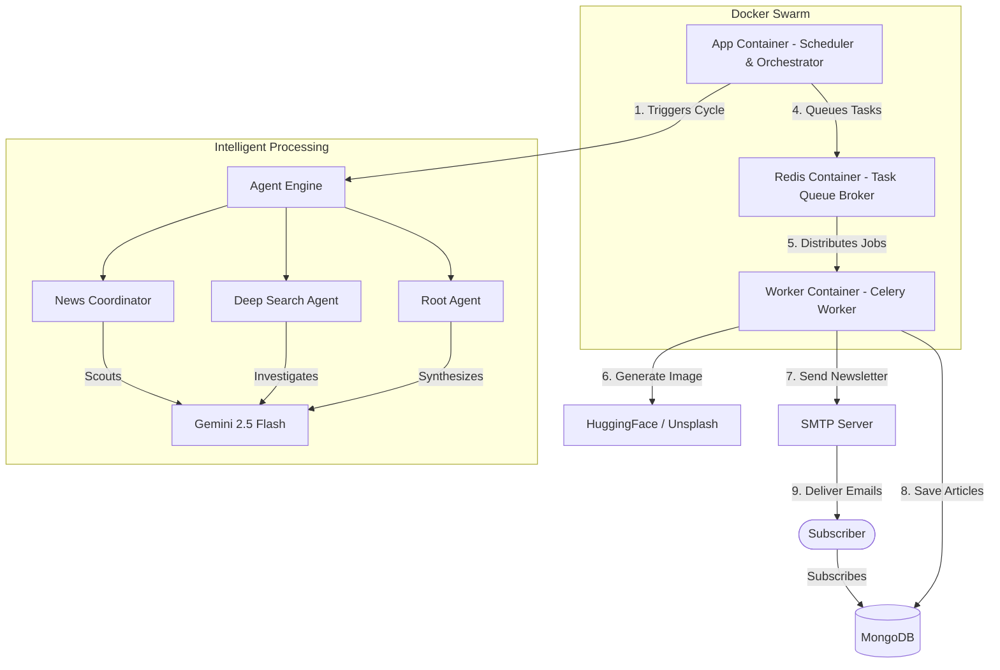

# **LucidTrend – Autonomous Tech News Agent System**

LucidTrend is a fully automated, autonomous agent ecosystem engineered to scout, analyze, synthesize, and publish high-impact technology news. It requires **zero human intervention**, operating as an AI-powered editorial team that runs end-to-end—from discovery to distribution.

---

## **Core Philosophy: Zero-Touch Automation**

LucidTrend is built on the idea of **autonomous recurrence**.
Once deployed, it acts as a self-sustaining system that:

* Triggers itself on a recurring schedule
* Handles failures and API inconsistencies
* Repairs malformed AI output
* Manages resources and workloads
* Produces polished, publication-ready content

It turns raw internet signals into structured, distributed technology news.

---

## **System Architecture**

The system is containerized via Docker Compose, dividing responsibilities across three core services:



---

## **How LucidTrend Works (Daily Cycle)**

LucidTrend operates twice every day at **05:00 AM** and **10:00 PM**, triggered by the scheduler inside `main.py`.

---

### **Phase 1: Scheduler Boot (Wake-Up Call)**

When the clock hits the scheduled time:

1. **Environment Validation**
   Ensures Gemini, MongoDB, HuggingFace, and SMTP credentials are available.

2. **Cycle Trigger**
   Launches the asynchronous `run_daily_cycle()` workflow.

---

### **Phase 2: News Intelligence (Agent Swarm)**

The `AgentEngine` activates a trio of specialized AI personas powered by **Gemini 2.5 Flash**:

#### **1. News Coordinator (Scout)**

* Identifies the most significant tech events in the last 24 hours
* Filters noise and low-impact items
* Produces a list of candidate headlines

#### **2. Deep Search Agent (Investigator)**

* Performs deeper research on each headline
* Collects historical context, market relevance, and technical implications
* Outputs structured facts

#### **3. Root Agent (Editor-in-Chief)**

* Turns facts into editorially polished articles
* Ensures consistent tone and formatting
* Outputs structured JSON representing the final articles

---

### **Phase 3: Data Cleaning & Fault Recovery**

All AI output passes through a sanitization layer:

* **JSON Repair**
  Automatically fixes malformed JSON via a secondary "Repair Agent".

* **Duplicate Detection**
  Prevents re-publishing similar news within a recent window.

* **Validation**
  Ensures essential fields are present before persistence.

---

### **Phase 4: Parallel Heavy Lifting (Celery Worker)**

The scheduler hands off resource-intensive tasks to Celery:

#### **1. Image Generation**

* Describes a visual concept using Gemini
* Generates photorealistic images via **HuggingFace FLUX.1-dev**
* **Fallback**: Fetches a relevant stock image from Unsplash
* Stores the final image URL in MongoDB

#### **2. Email Newsletter Broadcast**

* Fetches verified subscribers from MongoDB
* Auto-generates a custom subject line based on the day’s news
* Builds and sends a responsive HTML newsletter via SMTP

---

## **Directory Overview**

### **`app/`**

* **`main.py`** – Controls the daily cycle, error handling, and scheduling
* **`docker-compose.yml`** – Infrastructure definition (Scheduler, Worker, Redis)

### **`service/`**

* **`tasks/tasks.py`** – Celery tasks: image generation & email dispatch
* **`mongodb/`** – Database helpers for reading/writing articles & subscribers
* **`data_cleaning/`** – JSON repair and AI-output sanitization

---

## **Why This Stack?**

* **Docker** – Guarantees identical environments across development & production
* **uv** – Faster dependency resolution and deterministic builds
* **Celery + Redis** – Enables scalable, asynchronous job processing
* **Gemini 2.5 Flash** – High-speed reasoning with cost-efficient API usage

---

## **Commands**

```bash
# Build & start entire system
docker-compose up --build -d
```

```bash
# Stream logs
docker-compose logs -f
```
