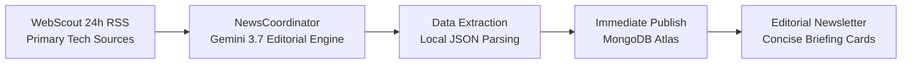
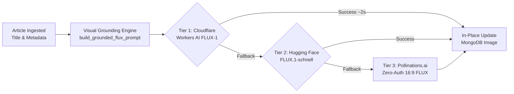
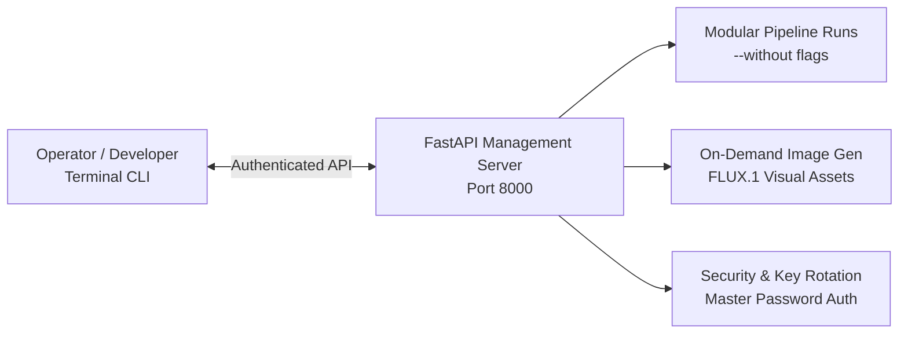

## LucidTrend

An autonomous technology intelligence engine that continuously scouts developer ecosystems, synthesizes high-impact technical analysis from breaking primary sources, generates custom photorealistic visual assets, and delivers clean editorial newsletters into one unified system.

---

## System Overview

### 1. Research and Publishing Pipeline

```mermaid
flowchart LR
    A[WebScout 24h RSS\nPrimary Tech Sources] --> B[NewsCoordinator\nGemini 3.7 Editorial Engine]
    B --> C[Data Extraction\nLocal JSON Parsing]
    C --> D[Immediate Publish\nMongoDB Atlas]
    D --> E[Editorial Newsletter\nConcise Briefing Cards]
```

### 2. High-Precision Image Synthesis Cascade

```mermaid
flowchart LR
    A[Article Ingested\nTitle & Metadata] --> B[Visual Grounding Engine\nbuild_grounded_flux_prompt]
    B --> C{Tier 1: Cloudflare\nWorkers AI FLUX-1}
    C -->|Success ~2s| F[In-Place Update\nMongoDB Image]
    C -->|Fallback| D{Tier 2: Hugging Face\nFLUX.1-schnell}
    D -->|Success| F
    D -->|Fallback| E[Tier 3: Pollinations.ai\nZero-Auth 16:9 FLUX]
    E --> F
```

### 3. Interactive Management & CLI

```mermaid
flowchart LR
    A[Operator / Developer\nTerminal CLI] <-->|Authenticated API| B[FastAPI Management Server\nPort 8000]
    B --> C[Modular Pipeline Runs\n--without flags]
    B --> D[On-Demand Image Gen\nFLUX.1 Visual Assets]
    B --> E[Security & Key Rotation\nMaster Password Auth]
```

---

## Detailed Documentation

For in-depth explanations, configuration guides, and complete operational instructions:

* **[Architecture & Mechanism Guide (docs/mechanism.md)](docs/mechanism.md)**: Deep dive into the 2-stage grounded intelligence pipeline, Cloudflare Workers AI FLUX cascade, story-grounded visual prompt engineering, and database protocols.
* **[User & Operations Guide (docs/use.md)](docs/use.md)**: Step-by-step setup guide for native and Docker environments, `.env` configuration (Cloudflare, Gemini, Mongo, SMTP), CLI commands, and REST API documentation.

---

  Developed by <a href="https://www.anamoldhakal.com.np/"><strong>Anamol Dhakal</strong></a>

