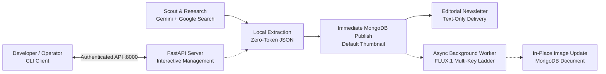

## LucidTrend

[](https://hub.docker.com/r/err0rz/lucid-trend)
[](https://hub.docker.com/r/err0rz/lucid-trend)
[](https://www.python.org/)

LucidTrend is an autonomous artificial intelligence platform designed to scout, research, synthesize, and publish high-impact technology journalism without human intervention. Operating continuously on an automated schedule, the system monitors developer ecosystems across the globe, analyzes primary engineering announcements, and produces comprehensive technical intelligence reports.

The platform combines multi-model language reasoning, deterministic local data parsing, resilient database persistence, asynchronous visual synthesis using state-of-the-art diffusion models, and high-deliverability editorial email distribution into a single cohesive architecture.

---

## System Overview


```mermaid
flowchart LR
    A[Scout & Research\nGemini + Google Search] --> B[Local Extraction\nZero-Token JSON]
    B --> C[Immediate MongoDB Publish\nDefault Thumbnail]
    C --> D[Editorial Newsletter\nText-Only Delivery]
    C -.-> E[Async Background Worker\nFLUX.1 Multi-Key Ladder]
    E -.-> F[In-Place Image Update\nMongoDB Document]
    
    G[Developer / Operator\nCLI Client] <--> |Authenticated API :8000| H[FastAPI Server\nInteractive Management]
    H -.-> B
```

### Core Architecture Highlights

* **Autonomous Multi-Agent Scouting**: Powered by Google Agent Development Kit (ADK) and Gemini 3.7 Flash, the intelligence engine monitors releases, architectural shifts, and benchmarks strictly within a 24-hour window.
* **Deterministic Non-Blocking Publishing**: News articles are parsed locally with zero token overhead and published immediately to MongoDB, ensuring zero latency for readers and API consumers.
* **Resilient Image Synthesis**: Visual assets are created exclusively via `black-forest-labs/FLUX.1-schnell` using an automated 4-key rotation mechanism with a 5-minute backoff retry ladder. As soon as an image is ready, the post is updated in-place.
* **Editorial-Grade Newsletters**: Dispatches clean, text-only briefings to verified subscribers using a disciplined, publication-grade layout free of artificial gimmicks.
* **Interactive CLI & Management API**: Includes an authenticated FastAPI server and companion command-line interface (`cli.py`) enabling operators to trigger modular runs (`--with` / `--without` flags), generate isolated images, and inspect live prompts without interrupting the running daemon.

---

## Detailed Documentation

For in-depth explanations, configuration guides, and architectural diagrams, refer to the dedicated documentation files:

* **[Architecture & Mechanism Guide (docs/mechanism.md)](docs/mechanism.md)**: Comprehensive deep dive into the cascading failover algorithms, asynchronous image ladder, deterministic data extraction, and component communication protocols with full Mermaid flowcharts.
* **[User & Operations Guide (docs/use.md)](docs/use.md)**: Complete step-by-step instructions for cloning, setting up `.env` credentials, running natively or via Docker Compose, manual API testing with Postman and cURL, and full CLI usage.

---

## Quick Start

### 1. Start the Server (Native or Docker)
```bash
# Native execution
python main.py

# Or via Docker Compose
docker-compose up -d --build

# Or pull directly from Docker Hub
docker pull err0rz/lucid-trend:latest
docker run -d --name lucid-trend-app -p 8000:8000 --env-file .env err0rz/lucid-trend:latest
```

### 2. Connect via the Interactive CLI
The CLI connects directly to the running server using your configured API key:

```bash
# Check server health
python cli.py status

# Run intelligence pipeline without writing to DB or sending emails
python cli.py pipeline --without email,db,image

# Generate a visual asset on-demand
python cli.py generate-image --title "Autonomous Agentic AI"
```

---

## 👤 Author & Credits

* **Developer:** [Anamol Dhakal](https://www.anamoldhakal.com.np/)
* **Role:** Backend System & Autonomous AI Developer
* **Project:** LucidTrend Autonomous Newsroom Engine

---

<div align="center">
  <sub>Built with Python, Google ADK, Gemini 3.7 Flash, Celery, Redis, MongoDB, and FLUX.1</sub>
</div>
