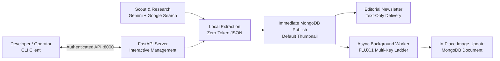

## LucidTrend

An intelligent platform that operates with multi-level workflows to scout developer ecosystems, analyze engineering updates, and publish technical reports. It brings together automated web research, reliable database storage, background image generation, and clean editorial email delivery into one unified system.

---

## System Overview

```mermaid
flowchart LR
    A[Scout & Research\nGemini + Google Search] --> B[Local Extraction\nZero-Token JSON]
    B --> C[Immediate MongoDB Publish\nDefault Thumbnail]
    C --> D[Editorial Newsletter\nText-Only Delivery]
    C -.-> E[Async Background Worker\nFLUX.1 Multi-Key Ladder]
    E -.-> F[In-Place Image Update\nMongoDB Document]
    
    G[Developer / Operator\nCLI Client] <--> |Authenticated API :8000| H[FastAPI Server\nInteractive Management]
    H -.-> B
```

---

## Detailed Documentation

For in-depth explanations, configuration guides, and architectural diagrams, refer to the dedicated documentation files:

* **[Architecture & Mechanism Guide (docs/mechanism.md)](docs/mechanism.md)**: Comprehensive deep dive into the cascading failover algorithms, asynchronous image ladder, deterministic data extraction, and component communication protocols with full Mermaid flowcharts.
* **[User & Operations Guide (docs/use.md)](docs/use.md)**: Complete step-by-step instructions for quick start, cloning, setting up `.env` credentials, running natively or via Docker Compose, manual API testing with Postman and cURL, and full CLI usage.

---

## 👤 Author & Credits

* **Developer:** [Anamol Dhakal](https://www.anamoldhakal.com.np/)
* **Role:** Backend System & Autonomous AI Developer
* **Project:** LucidTrend Autonomous Newsroom Engine

---

  Built with Python, Google ADK, Gemini 3.7 Flash, Celery, Redis, MongoDB, and FLUX.1

