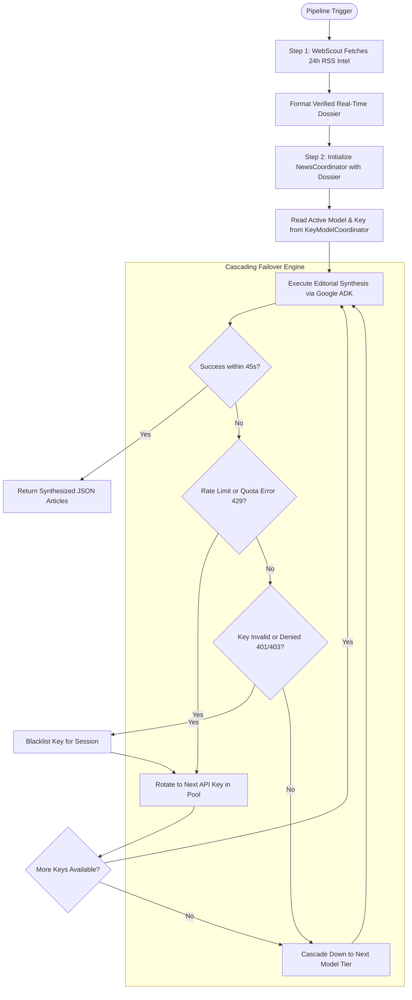
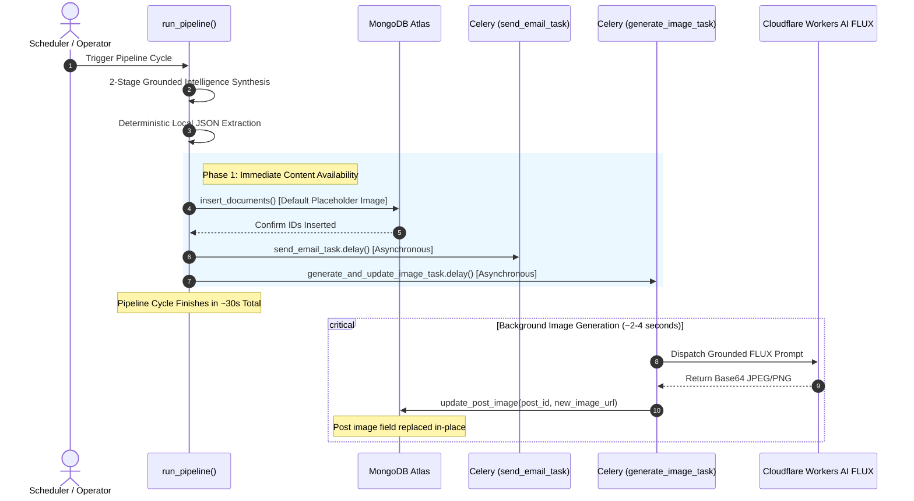
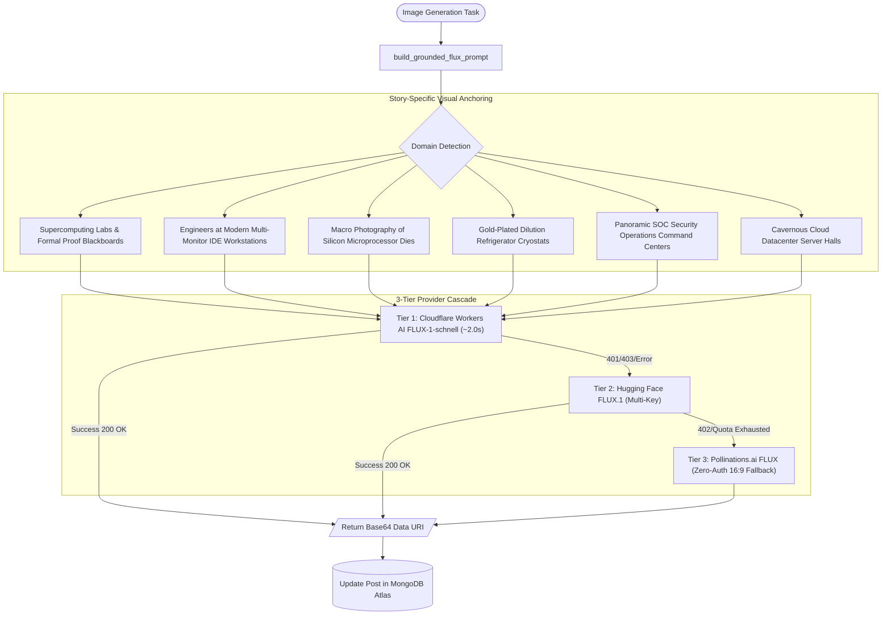
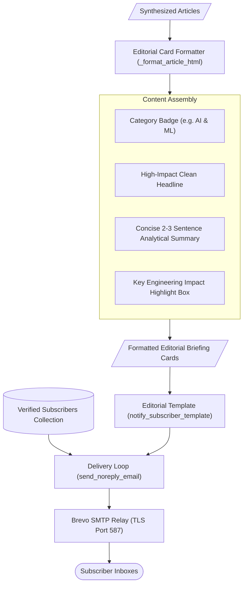

# LucidTrend System Architecture

LucidTrend is an autonomous technology intelligence and publishing system. It continuously scouts global developer ecosystems, synthesizes comprehensive technical articles from breaking primary sources, generates custom photorealistic visual assets, updates a content database, dispatches clean editorial briefings to subscribers, and provides an authenticated command-line interface for interactive control.

This document details the internal mechanics, algorithmic decisions, and communication protocols governing the entire architecture.

---

## 1. End-to-End System Architecture

The LucidTrend ecosystem is divided into autonomous background services, external model inference networks, storage engines, delivery channels, and an interactive management layer.

```mermaid
flowchart TD
    subgraph Management ["Interactive Management Layer"]
        CLI["LucidTrend CLI (cli.py)"]
        API["FastAPI Server (:8000)"]
        Auth["API Key Middleware"]
        CLI --> |X-API-Key HTTP Request| Auth
        Auth --> API
    end

    subgraph Orchestration ["Core Scheduler & Pipeline (main.py)"]
        Scheduler["Schedule Daemon (05:00 & 17:00)"]
        Cleaner["Hourly Temp Directory Cleaner"]
        Runner["Pipeline Orchestrator (run_pipeline)"]
        API --> |Modular Trigger (--with/--without)| Runner
        Scheduler --> |Scheduled Daily Run| Runner
        Cleaner --> |Purges Expired Files| TempDir["temp/ Directory"]
    end

    subgraph Intelligence ["2-Stage Grounded Intelligence Pipeline"]
        WebScout["WebScout RSS Engine (24h Google News Feeds)"]
        NewsCoordinator["NewsCoordinator (Gemini 3.7 Flash)"]
        GeminiPool["Gemini Model Pool & Key Cascading Coordinator"]
        WebScout --> |Verified Real-Time Dossier| NewsCoordinator
        NewsCoordinator --> GeminiPool
    end

    subgraph Extraction ["Deterministic Local Parsing"]
        LocalParser["Zero-Token Fast Extractor (fast_extract)"]
    end

    subgraph Persistence ["Immediate Publishing Layer"]
        MongoService["MongoDB Service (MongoDBService)"]
        MongoCluster[("MongoDB Atlas (posts collection)")]
        MongoService --> |1. Insert with Default Image| MongoCluster
    end

    subgraph Newsletter ["Editorial Delivery Engine"]
        EmailWorker["Newsletter Dispatcher (send_email_task)"]
        SMTPRelay["SMTP Relay Server (TLS)"]
        Subscribers[("Verified Subscribers")]
        EmailWorker --> |Fetch Verified Addresses| Subscribers
        EmailWorker --> |Transmit Concise HTML Cards| SMTPRelay
    end

    subgraph Imagery ["3-Tier High-Precision Image Cascade"]
        ImageWorker["Celery Worker / Fallback Thread"]
        VisualDirector["Visual Grounding Engine (build_grounded_flux_prompt)"]
        CF_AI["Tier 1: Cloudflare Workers AI FLUX-1-schnell"]
        HF_AI["Tier 2: Hugging Face FLUX.1 (Multi-Key)"]
        Pollinations["Tier 3: Pollinations.ai FLUX (Zero-Auth 16:9)"]
        
        ImageWorker --> VisualDirector
        VisualDirector --> CF_AI
        CF_AI -.->|Fallback| HF_AI
        HF_AI -.->|Fallback| Pollinations
        CF_AI --> |In-Place Base64 Update| MongoCluster
        HF_AI --> |In-Place Base64 Update| MongoCluster
        Pollinations --> |In-Place Base64 Update| MongoCluster
    end

    Runner --> Intelligence
    Intelligence --> LocalParser
    LocalParser --> Persistence
    Persistence --> Newsletter
    Persistence -.-> |Non-Blocking Trigger| Imagery
```

---

## 2. Multi-Model Intelligence Engine and Cascading Failover

The intelligence subsystem synthesizes technical news articles using Google Agent Development Kit (ADK) and the Gemini family of language models, wrapped in a 45-second circuit breaker with automatic failover across multiple API keys and model tiers.



### Model Cascade Ladder

| Tier | Model ID | Timeout | Primary Purpose |
| :---: | :--- | :---: | :--- |
| **Tier 1** | `gemini-3.7-flash` | 45s | Flagship hybrid reasoning, highly detailed technical journalism. |
| **Tier 2** | `gemini-3.5-flash-lite` | 45s | High-efficiency fallback model for high-throughput synthesis. |
| **Tier 3** | `gemini-3.1-flash-lite` | 45s | Resilient secondary fallback model. |
| **Tier 4** | `gemini-flash-latest` | 45s | Ultimate fallback targeting Gemini Flash stable channel. |

---

## 3. Asynchronous Decoupling Architecture

To ensure immediate frontend availability and rapid email delivery, visual generation is completely decoupled from article persistence:



---

## 4. High-Precision Image Synthesis & 3-Tier Multi-Provider Cascade

Rather than relying on generic diffusion prompts that produce abstract floating dots in dark space, LucidTrend utilizes an automated **Visual Grounding Engine** paired with a resilient 3-tier cascade:



### Visual Grounding Principles
- **Hardware & Semiconductors**: Macro shots of etched silicon dies, gold wire bonds, and liquid cooling rather than generic digital graphics.
- **Developer Tools & Frameworks**: Software engineers in modern studios with ultra-wide screens displaying actual IDE code syntax, debug consoles, and twilight city views.
- **Mathematical Reasoning & AI**: Modern research laboratories with illuminated formal logic blackboards and operator terminals.
- **Quantum Computing**: Dilution cryostats with gold-plated plates and braided copper wiring in cleanroom environments.

---

## 5. Concise Editorial Newsletter Architecture

The email distribution subsystem is designed specifically for technical professionals, focusing on clarity, typography, and deliverability.



- **Clean Typography**: Eliminates raw 500-word markdown code dumps and ASCII diagrams from email inboxes while preserving the complete deep-dive content on the website.
- **Key Engineering Impact**: Highlighting critical takeaways, migration hurdles, or benchmark gains in a dedicated callout box.
