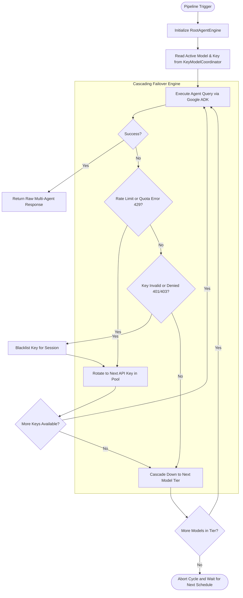
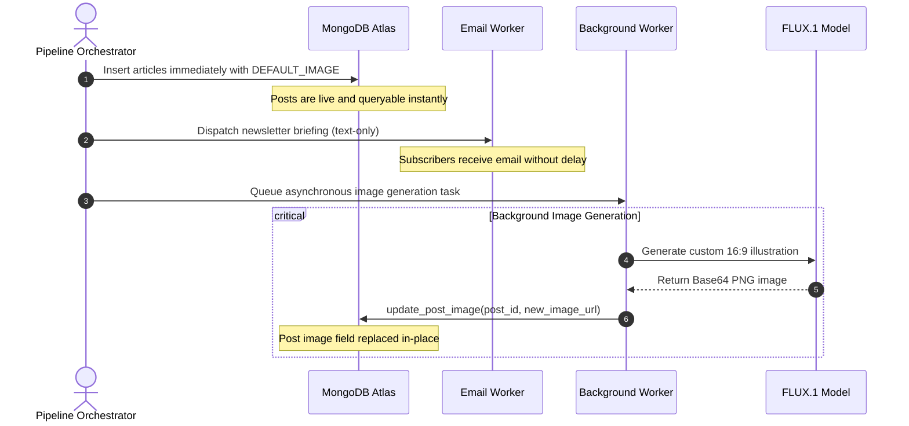
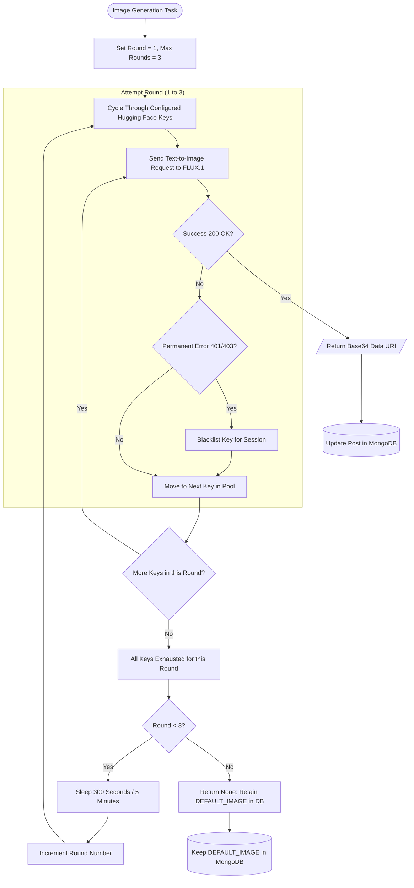
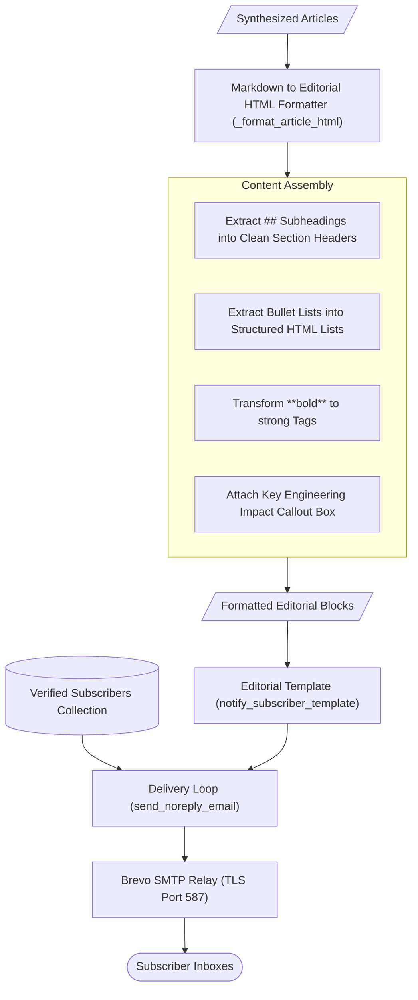
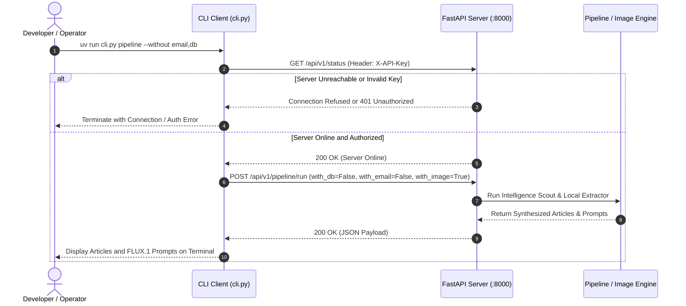

# LucidTrend System Architecture

LucidTrend is an autonomous technology intelligence and publishing system. It continuously scouts global developer ecosystems, synthesizes comprehensive technical articles from breaking primary sources, generates custom visual assets, updates a content database, dispatches text-only editorial briefings to subscribers, and provides an authenticated command-line interface for interactive control.

This document details the internal mechanics, algorithmic decisions, and communication protocols governing the entire architecture.

---

## 1. End-to-End System Architecture

The LucidTrend ecosystem is divided into autonomous background services, external model inference networks, storage engines, delivery channels, and an interactive management layer.

```mermaid
flowchart TD
    subgraph Management ["Interactive Management Layer"]
        CLI["LucidTrend CLI (cli.py)"]
        API["FastAPI Server (:8000)"]
        Auth["API Key Middleware"]
        CLI --> |X-API-Key HTTP Request| Auth
        Auth --> API
    end

    subgraph Orchestration ["Core Scheduler & Pipeline (main.py)"]
        Scheduler["Schedule Daemon (05:00 & 17:00)"]
        Cleaner["Hourly Temp Directory Cleaner"]
        Runner["Pipeline Orchestrator (run_pipeline)"]
        API --> |Modular Trigger (--with/--without)| Runner
        Scheduler --> |Scheduled Daily Run| Runner
        Cleaner --> |Purges Expired Files| TempDir["temp/ Directory"]
    end

    subgraph Intelligence ["Multi-Model Scouting Engine"]
        RootAgent["NewsCoordinator (RootAgentEngine)"]
        Scout["NewsFindingAgent (24h Window)"]
        Investigator["DeepInvestigator (Technical Analysis)"]
        GeminiPool["Gemini Model Pool & Key Cascading Coordinator"]
        RootAgent --> Scout
        RootAgent --> Investigator
        Scout --> GeminiPool
        Investigator --> GeminiPool
    end

    subgraph Extraction ["Deterministic Local Parsing"]
        LocalParser["Zero-Token Fast Extractor (fast_extract)"]
    end

    subgraph Persistence ["Immediate Publishing Layer"]
        MongoService["MongoDB Service (MongoDBService)"]
        MongoCluster[("MongoDB Atlas (posts collection)")]
        MongoService --> |1. Insert with Default Image| MongoCluster
    end

    subgraph Newsletter ["Editorial Delivery Engine"]
        EmailWorker["Newsletter Dispatcher (send_email_task)"]
        SMTPRelay["SMTP Relay Server (TLS)"]
        Subscribers[("Verified Subscribers")]
        EmailWorker --> |Fetch Verified Addresses| Subscribers
        EmailWorker --> |Transmit Text-Only HTML| SMTPRelay
    end

    subgraph Imagery ["Asynchronous FLUX.1 Image Ladder"]
        ImageWorker["Celery Worker / Fallback Thread"]
        HFCoordinator["HuggingFace Key Coordinator (4 Keys)"]
        FLUX["black-forest-labs/FLUX.1-schnell"]
        ImageWorker --> HFCoordinator
        HFCoordinator --> |Text-to-Image Inference| FLUX
        ImageWorker --> |2. In-Place Update Image/Thumbnail| MongoCluster
    end

    Runner --> Intelligence
    Intelligence --> LocalParser
    LocalParser --> Persistence
    Persistence --> Newsletter
    Persistence -.-> |Non-Blocking Trigger| Imagery
```

---

## 2. Multi-Model Intelligence Engine and Cascading Failover

The intelligence subsystem identifies, investigates, and synthesizes technical news articles using Google Agent Development Kit (ADK) and the Gemini family of language models.



### The Failover Mechanism Explained

1. **Model Pool Hierarchy**: The system maintains an ordered cascade of models:
   - Primary Tier: `gemini-3.7-flash`
   - Secondary Tier: `gemini-flash-latest`
   - Tertiary Tier: `gemini-flash-lite-latest`
   - Fourth Tier: `gemini-3.5-flash-lite`
   - Fifth Tier: `gemini-3.1-flash-lite`
   - Sixth Tier: `gemini-3.5-flash`

2. **Key Coordination**: When multiple Google API keys are defined in the environment as a comma-separated list, `KeyModelCoordinator` manages active indices. If a request encounters a rate limit (HTTP 429) or quota saturation, it switches to the next available key on the same model tier.

3. **Model Cascading**: If all API keys are exhausted on the active model, the system steps down to the next model tier and resets the key index to zero. This ensures uninterrupted news scouting across free-tier limits without human intervention.

4. **Agent Responsibilities**:
   - `NewsFindingAgent`: Queries Google Search strictly for verified developments announced within the prior 24 hours across AI, cloud systems, compilers, databases, and developer tooling.
   - `DeepInvestigator`: Takes verified headlines and investigates architecture shifts, benchmarks, breaking API changes, and developer migrations.
   - `NewsCoordinator`: Compiles the research into cohesive, structured technical articles matching the strict JSON schema.

---

## 3. Zero-Token Deterministic Article Extraction

Rather than using secondary model tokens to parse and reformat intelligence outputs, the system utilizes local regular expression extraction and JSON parsing.

```mermaid
flowchart TD
    RawAgentOutput[/Raw Agent Output String/] --> DirectJSON{Attempt Direct JSON Parsing}
    
    DirectJSON -- Valid List --> OutputValid[/Structured Article List/]
    DirectJSON -- Fails --> CodeFence{Regex Match Code Fences: ```json ... ```}
    
    CodeFence -- Valid List --> OutputValid
    CodeFence -- Fails --> ArrayRegex{Regex Match Bracketed Array: [ ... ]}
    
    ArrayRegex -- Valid List --> OutputValid
    ArrayRegex -- Fails --> FallbackLLM[Invoke Fallback LLM Schema Parser]
    
    FallbackLLM --> OutputValid
```

This local parsing engine ensures that even when language models wrap JSON responses in conversational preambles or code fences, the data is extracted with zero additional API latency and zero token cost.

---

## 4. Immediate Database Persistence and In-Place Asset Replacement

The pipeline decouples publishing speed from visual generation latency. Articles are published immediately with a default image so that readers and API consumers receive news without waiting.



### Detailed Sequence of Events

1. **Format with Defaults**: Each extracted article is enriched with author attribution metadata and assigned the high-resolution fallback image URL (`DEFAULT_IMAGE`) for both the `image` and `thumbnail` fields.
2. **Immediate Document Insert**: `MongoDBService.insert_documents()` executes an `insert_many` operation against the configured collection. The articles are immediately visible on the website frontend.
3. **Dispatch Email**: The pipeline proceeds directly to subscriber notifications without waiting for visual generation.
4. **Queue Worker Task**: An asynchronous task is dispatched to Celery (`generate_and_update_image_task`). If Celery or Redis is unavailable during local execution, the task automatically falls back to an independent daemon thread.
5. **In-Place Image Update**: When the worker completes image synthesis, it executes an atomic `$set` update on MongoDB:
   ```json
   {
     "$set": {
       "image": "data:image/png;base64,...",
       "thumbnail": "data:image/png;base64,..."
     }
   }
   ```
   Visitors refreshing the page now observe the synthesized FLUX.1 visual asset.

---

## 5. FLUX.1 Multi-Key Rotation and 5-Minute Retry Engine

Image synthesis relies exclusively on `black-forest-labs/FLUX.1-schnell`. Because free-tier inference APIs enforce request limits, a multi-round backoff ladder guarantees resilient execution.



### Key Execution Rules

- **Key Pool**: All keys listed under `HUGGING_FACE_TOKENS` in `.env` are parsed, trimmed, and deduplicated.
- **Round Execution**: In each round, the worker attempts synthesis on the active key. Upon error (e.g. rate limit HTTP 429 or server timeout HTTP 503), it immediately rotates to the subsequent key.
- **Permanent Auth Handling**: If a key returns HTTP 401 or 403, it is marked as invalid and excluded from future cycles within that session.
- **The 5-Minute Pause**: If all available keys fail in a single round, the process pauses execution for 300 seconds (5 minutes). This window allows free-tier sliding window quotas to reset.
- **Max Retry Window**: The process repeats for up to 3 full rounds (a minimum of 15 minutes of retries). If all rounds fail, the system logs the event and retains the default placeholder.

---

## 6. Text-Only Editorial Newsletter Architecture

The email distribution subsystem is designed specifically for technical professionals, focusing on clarity, typography, and deliverability.



### Editorial Design Principles

1. **No Embedded Images**: To prevent spam classification and ensure instantaneous loading across all email clients, visual assets are omitted from newsletters.
2. **Structured Analysis**: Every article includes:
   - A standardized topic category indicator.
   - An executive summary.
   - Architectural context and technical analysis.
   - A dedicated engineering impact summary box.
3. **Typography**: Clean, high-contrast system typography with disciplined margins and balanced line heights.
4. **Tone**: Objective, authoritative reporting derived strictly from engineering documentation, release notes, and benchmarks.

---

## 7. Interactive Management Layer: Client-Server Protocol

To allow developers and operators to inspect, trigger, and debug system functions without stopping or restarting the running background server, LucidTrend includes an authenticated client-server interface.



### Security and Storage Mechanics

- **Authentication**: All endpoints require validation against `API_SECRET_KEY` using either the `X-API-Key` header or `Authorization: Bearer <key>`.
- **Server Enforcement**: The CLI client validates connectivity and authentication before dispatching any command. If the server is offline, commands terminate immediately.
- **Local vs Remote Image Outputs**:
  - When an image is generated via CLI, the server generates the file, stores it temporarily in the server's `temp/` directory, and serves it over static HTTP.
  - The CLI client automatically downloads the binary file from the server and writes it directly to the operator's current local directory.
- **Hourly Temp Folder Sweeper**: An automated background cleaner checks the `temp/` folder every hour and deletes files older than 3600 seconds, preventing storage saturation.
